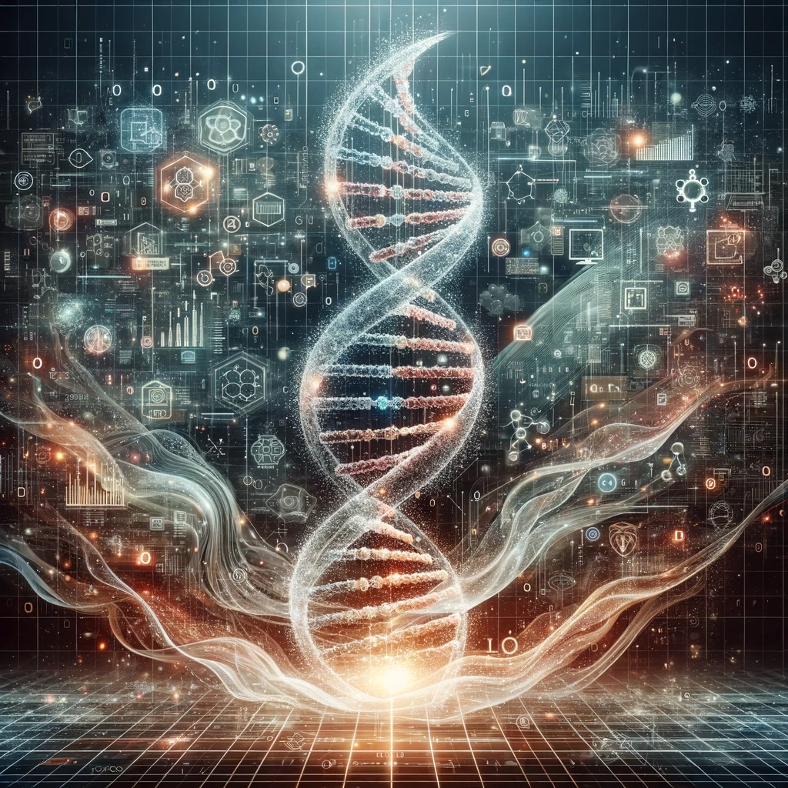

# Bioinformatics Resources: An Introduction

<p align="center">
    
</p>


### Description

Programming and mathematics resources for an introductory review of bioinformatics problems. 

### Poetry Env

If you want to export the requirements for using a different
type of env, you can execute: 

```
poetry export -f requirements.txt --output requirements.txt
```

## Syllabus


### Basic Mathematical Concepts:

- Statistics and Probability: Essential for understanding biological variability and for the analysis of sequences and genomic data. This includes concepts like mean, median, mode, standard deviation, probability distributions, hypothesis testing, and more.

- Linear Algebra: Useful for analyzing high-dimensional data such as gene expression data. Key concepts include vectors, matrices, matrix operations, eigenvalues, and eigenvectors.

- Calculus: Important for understanding dynamic models in biological systems, including concepts such as differentiation, integration, and differential equations.
These mathematical foundations are crucial for bioinformatics, as they underpin many of the algorithms and analyses used in the field.

### Basic Programming Concepts:
- Programming Languages: ```Python``` and ```R``` are very popular in bioinformatics. Python is widely used for scripting and automation, while R is excellent for statistical analysis and plotting.

- Database Management: SQL for relational databases and basic knowledge of NoSQL for more flexible database structures.
Data Structures and Algorithms: Particularly important are data structures for handling biological sequences (like trees and graphs) and algorithms for their analysis and comparison.

- Data Analysis and Visualization: Learn to use libraries like Pandas, NumPy, Matplotlib in Python, or ggplot2 in R.
Suggested Initial Project:
An excellent initial project could be the analysis of DNA sequences from a small database, for example, comparing genetic sequences of a model organism like Escherichia coli.

### Basic Project Steps:

- Data Collection: Use a small database like NCBI (National Center for Biotechnology Information) to obtain DNA sequences of E. coli.

- Sequence Analysis: Perform basic sequence analysis, such as searching for common motifs, calculating GC content, or identifying conserved regions.

- Data Visualization: Visualize the results using, for example, Matplotlib or Seaborn in Python. You can create charts that show the GC content per sequence or the distribution of certain motifs.
This syllabus and project outline should provide a solid foundation for beginning studies in bioinformatics.